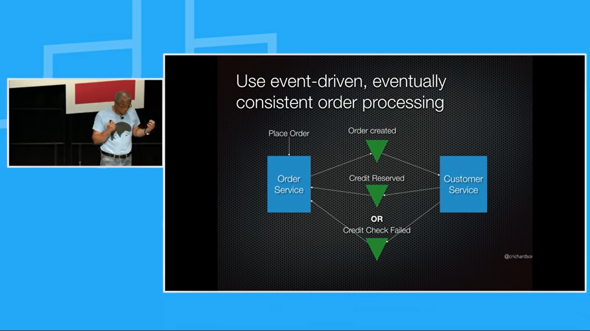

## 風格:
# 2022-3a C109118123
## 2022-3a C109118123
### 2022-3a C109118123
#### 2022-3a C109118123
##### 2022-3a C109118123


## Emoji:
💻


## 圖片插入:


## 嵌入影片:
[](https://www.youtube.com/watch?v=StTqXEQ2l-Y "Everything Is AWESOME")


- [ ] todo list
- [x] done


## 區塊:
### Python code
```python

s = "Python syntax highlighting"
print s

```
### javascript code
```javascript

var s = "javascript syntax highlighting";
alert (s);

```


>Emphasis, aka italics, with asterisks or underscores.
>
>Strong emphasis, aka bold, with asterisks or underscores.
>
>Combined emphasis with asteriskd and underscores.
>
>Strikethrough uses two tildes. Scratch this.

---

>1.First ordered list item
>
>2.Another item
  >>..* Unordered sub-list.
  >>
>3.Actual numbers don't matter,just that it's a number
  >>..1.Ordered sub-list
  >>
  >>...2.2nd
  >>
>4.And another item.
  >>...* note 1
  >>
  >>...* note 2
  >>
  >>*** note 3


## 表格:
| Left-Aligned | Left-Aligned | Left-Aligned |
| :----------- |:--------------:| -----:|
| col 3 is     | some wordy text| $1600 |
| col 2 is     | centered       |   $12 |
| Zebra stripes| are neat       |    $1 |
| test | 測試       |    $3333 |

| Left-Aligned | Left-Aligned   | Left-Aligned |
| :----------- |:---------------| :--------|
| Still        | `Renders`      | nicely   |
| 1            | 2              |3         |


[](https://www.youtube.com/watch?v=sSm2dRarhPo "Microservices + Events + Docker = A Perfect Trio")


